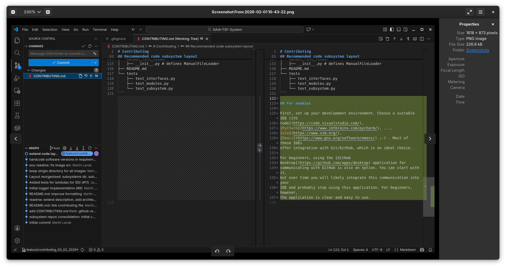
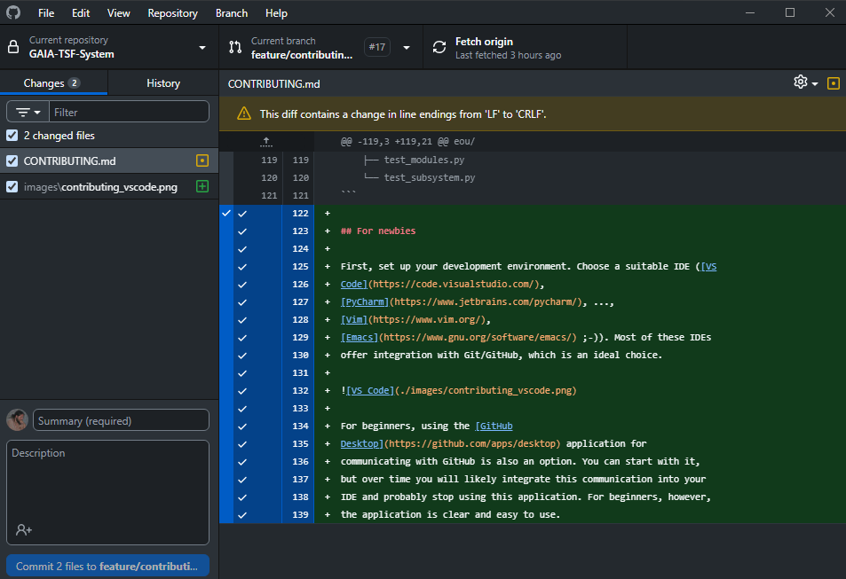

# Contributing

Coding style [PEP 8 (Style Guide for Python Code)]:

- Class names: `CapWords`
- Class properties/variables: `snake_case`
- Class methods/function names: `snake_case`
- Protected properties/methods: `_snake_case`
- Private properties/methods: `__snake_case`
- Package names should be short, all-lowercase, and preferably without underscores.
- 2 blank lines before a class definition
- 1 blank line before a function definition
- trailing comma at the last argument of one-arg-per-line-formatted func calls
- single quotes for string definitions unless the string already contains them

Branching Strategy

- `main`: Production-ready code (matches CDR baseline).
- `develop`: Integration branch for the current sprint.
- `feature/*`: Individual tasks.

Collaboration and Code Review

- create Pull Request (PR) for completed features or bugfix (base branch: `develop`)
- conduct peer code reviews
- use comments and suggestions to improve code quality
- resolve conflicts and ensure code consistency
- merge PR only when approved
- optionally use GitHub Projects to break into tasks, features, and bug fixes

Issue Tracking

- use GitHub Issues to manage tasks and bugs
- assign issues, set labels, milestones, and priorities
- link commits and PRs to issues

Continuous Integration (CI)

- configure GitHub Actions for automatic testing
- run unit tests and static analysis on every push and PR
- prevent merging if tests fail
- code quality check tests open automated PRs fixing the violations - merge them
  - if the code quality check is automatically unfixable, the CQ test will fail
    to create a PR (in order to avoid introducing bugs)
  - unfixable issues and explanations:
    - Undefined name: it is impossible to know if it is a typo or a missing
      definition
    - no `snake_case` for an object name: it is impossible to know if it should
      be a variable/function (just the name is wrongly formatted) or a class
      (the name is correctly formatted but wrong clausule used, e.g. `def`
      instead of `class`)
    - Local variable is assigned to but never used - it is impossible to know
      if you forgot to use it or you named the variable wrong

Documentation

- update README with usage instructions
- document code with docstrings and comments

Release Management

- tag stable versions using semantic versioning
- create GitHub Releases with release notes

## Programming languange and style

- Python
- Object oriented paradigm
- tests driven by `pytest` package

## Deployment strategy

- use a unified deployment system (Docker)
- use a unified base image (python-3.14?)
- use pre-built images for CI

## Recommended code subsystem layout

Subsystems code is placed in `subsystems` directory. Subsystems are
defined in separate sub-directories, which are named according to the
subsystem abbreviation.

Recommended layout for a single subsystem:

```
subsystem_name_abbreviated
├── __init__.py
├── module_name_1
│   └── __init__.py
├── module_name_2
│   └── __init__.py
├── README.md
└── tests
    ├── test_interfaces.py
    ├── test_modules.py
    └── test_subsystem.py
```

The `__init__.py` file defines the subsystem class carrying its full
(unabbreviated) name. Individual subsystem modules are defined in
sub-directories. Each of these sub-directories contains an
`__init__.py` file with the definition of the corresponding module
class. The names of the module sub-directories and the module classes
are derived from the full (unabbreviated) module names.

The `tests` directory contains three separate files. The
`tests_subsystem.py` contains tests focused on the subsystem as a
whole. The `test_modules.py` file contains unit tests targeting
individual components of the subsystem. The last file,
`test_interfaces.py`, contains integration tests that verify the
integration of individual modules within the subsystem and within the
system as a whole.

There is also a `README.md` file containing information about the
subsystem, including a figure describing the design of the subsystem
and its individual modules.

Here is a minimalistic example for *Earth Observation Data Uploader*
subsystem:

```
eou/
├── __init__.py     # defines EarthObservationDataUploader class
├── data_acquisition_gateway
│   └── __init__.py # defines DataAcquisitionGateway class
├── data_extraction
│   └── __init__.py # defines DataExtraction class
├── manual_file_loader
│   └── __init__.py # defines ManualFileLoader
├── README.md
└── tests
    ├── test_interfaces.py
    ├── test_modules.py
    └── test_subsystem.py
```

## For newbies

First, set up your development environment. Choose a suitable IDE ([VS
Code](https://code.visualstudio.com/),
[PyCharm](https://www.jetbrains.com/pycharm/), ...,
[Vim](https://www.vim.org/),
[Emacs](https://www.gnu.org/software/emacs/) ;-)). Most of these IDEs
offer integration with Git/GitHub, which is an ideal choice.



For beginners, using the [GitHub
Desktop](https://github.com/apps/desktop) application for
communicating with GitHub is also an option. You can start with it,
but over time you will likely integrate this communication into your
IDE and probably stop using this application. For beginners, however,
the application is clear and easy to use.



### Recommended workflow

1. Create a new branch (`feature/something` or `bugfix/something`) from `develop` branch
2. Switch to the new branch
3. Make modifications by implementing a new feature or correcting a bug in the code
4. Commit changes (may be split into multiple commits)
5. Create PR on [GitHub](https://github.com/GAIA-TSF/GAIA-TSF-System/compare)
6. Set up labels, milestone, reviewer(s) and assignee (yourself)
7. If PR approved then your or reviewer will merge PR into `develop`
   branch.
8. If the opponent has comments, respond to them (possibly by new commits)
9. Repeat this process until the PR is approved (rule: a PR that is
   not approved cannot be merged)
