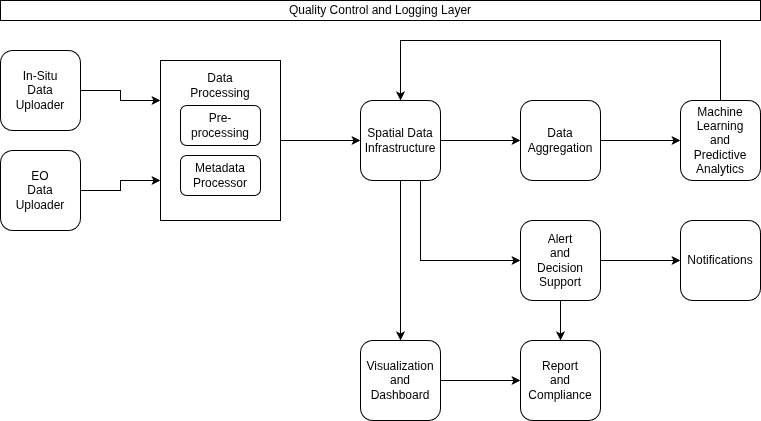

# GAIA-TSF System


Major repository for GAIA-TSF System

See [CONTRIBUTING](CONTRIBUTING.md) file for more details.

See [examples](examples/) for standalone scripts
demonstrating typical GAIA-TSF workflows.

The example can be executed as follows:

```sh
cd docker/
docker compose exec -u $(id -u):$(id -g) gaiatesting python3 -m examples.eou_download_sentinel2
```

## GAIA-TSF Subsystems



Individual GAIA-TSF subsystems are located in the `subsystems` directory. Each GAIA-TSF
subsystem corresponds to a subdirectory within `subsystems` directory, named
according to the abbreviation of the respective GAIA-TSF subsystem.

| Abbreviation | GAIA-TSF Subsystem |
|-------------|-------------|
| ALE | Alert & Decision Support Engine |
| DAG | Data Aggregation |
| DPR | Data Processor |
| EOU | Earth Observation Data Uploader |
| ISU | In-Situ Data Uploader |
| MAP | Machine Learning & Predictive Analytics |
| NTF | Notifications |
| QCL | Quality Control and Logging Layer |
| REP | Reporting & Compliance |
| SDI | Spatial Data Infrastructure |
| VID | Visualisation & Dashboard |
