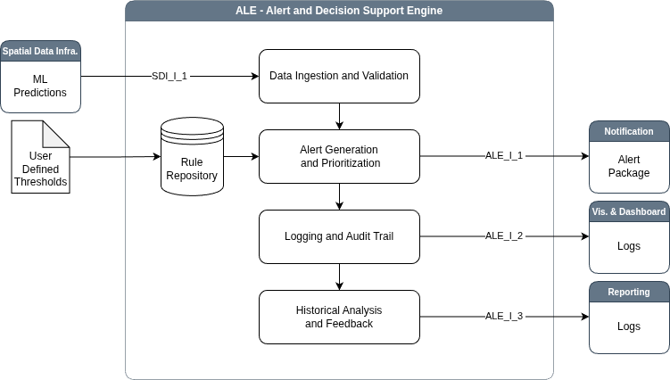

# Alert Decision Support Engine (ALE) Sub-system

The **Alert and Decision Support Engine** continuously processes
information from the SDI sub-system, which provides outputs from
machine learning models such as time series trend analyses,
deformation rates, vegetation and land cover changes, and predictions
of water and soil chemical properties. The ALE evaluates these data to
determine whether conditions at a TSF are normal or indicative of an
anomaly or risk. When a threshold is exceeded or an unusual pattern is
detected, the engine categorizes the severity and sends alerts to the
notification system for dissemination to relevant stakeholders.

## Usage
