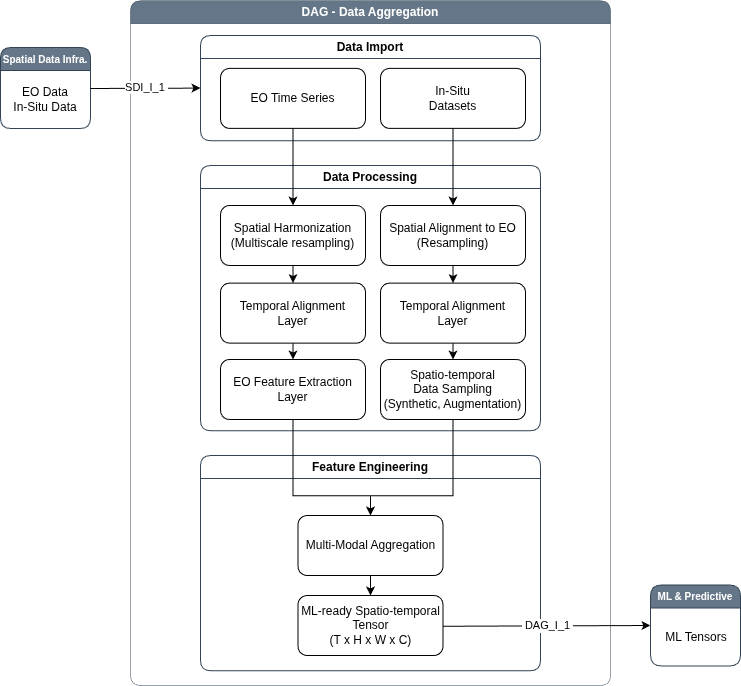

# Data Aggregation (DAG) Sub-system 

The **Data Aggregation** sub-system serves as the critical
processing bridge that transforms data stored within the
Spatial Data Infrastructure (SDI) into structured inputs suitable for
machine learning analysis. Its primary function is to prepare data in
structures that are harmonised and ready for downstream consumption,
adhering to the principle that "garbage in, garbage out" dictates
model performance. The sub-system ingests multi-temporal satellite
image stacks (e.g., Sentinel-2) and co-located in-situ measurements
(e.g., pH, pore pressure) to produce model-ready feature tensors.



## Key Capabilities

- Multi-temporal EO data ingestion (Sentinel-1, Sentinel-2)
- Exploratory Data Analysis (EDA): step important to select the following steps 
- Spatial harmonization (resampling to common grid)
- Feature engineering:
  - Slope stability: displacement → velocity → acceleration
  - AMD: spectral indices and AMD index
  - Meteorology: precipitation accumulations/extremes and temperature metrics
- Masking (AOI, water mask)
- Data preprocessing:
  - normalization (min-max, z-score)
  - missing value handling
  - outlier handling / log transform
- Validation and consistency checks


## Inputs

- **Slope Stability (KV1)**
  - Sentinel-1 LOS displacement time series
  - AOI mask

- **AMD (KV2)**
  - Sentinel-2 multispectral time series
  - AOI mask
  - TSF, clean water mask (optionally leak water mask) 

## Outputs

- graphs and maps 
- ML-ready features: spatiotemporal feature cubes
- Derived features:
  - velocity, acceleration (slope stability), etc. 
  - AMD index spectral features and its temporal derivatives 
- Ready for probabilistic anomaly detection (MAP subsystem)

## Architecture

**Workflow:** Raw EO Data -> Ingestion -> Preprocessing (Harmonization: spatial / temporal) -> Masking (AOI, water) -> Feature Engineering -> ML-ready dataset 

### Meteorological features

Meteorological processing is available through the `meteo_features` pipeline.
The repository configuration is ready for the synthetic project's daily CSV:

```bash
python3 subsystems/dag/run_pipeline.py \
  --pipeline meteo_features \
  --config subsystems/dag/config.yaml
```

The pipeline writes one dated multiband GeoTIFF per enabled feature and a
`metadata.json` file to `meteorology.results.output_dir`.

The default configuration reads daily observations from `inputs/meteodata.csv`
and broadcasts them over the configured TSF mask. Features are engineered on
the daily series and then sampled on `meteorology.inputs.insar` acquisition
dates, making every output band align with the InSAR temporal axis. A CSV must
contain `date`,
`precipitation`, `temperature_mean`, `temperature_min`, and `temperature_max`
columns. Separate dated GeoTIFF series are also supported through per-variable
`directory` and `filename_pattern` input mappings.

### Synthetic in-situ co-location

Create the in-situ CSV by spatially overlaying every labelled point from the
GeoPackage configured under `in_situ.static.observation_points` on each
configured TRUE_LOS acquisition:

```bash
python3 subsystems/dag/scripts/extract_synthetic_tsf_in-situ_deformations.py \
  --config subsystems/dag/config.yaml
```

The DAG `in_situ.sampling.window_size` setting controls the square, nodata-aware
pixel neighbourhood used for each sample. The script accepts any number of
uniquely labelled observation points. All paths are resolved below the DAG
`project_dir`; use `--project-dir` to override that root.

Run the independent validation step after extraction:

```bash
python3 subsystems/dag/scripts/compare_insar_insitu.py \
  --config subsystems/dag/config.yaml
```

This script samples the configured satellite LOS rasters at the locations and
dates in the in-situ CSV. It writes a two-column
`insar_los,insitu_deformation` comparison CSV and a JSON report containing
sample counts, dataset means, bias, MAE, RMSE, Pearson correlation, and R².
Their paths and the raster-to-output unit scale are configured under
`in_situ.validation`. `sampling_window_size: 3` selects a 3×3 nodata-aware
InSAR mean centred on every in-situ location.


## Run the pipelines 

Feature normalization is disabled by default. Enable it globally for generated
DAG features with either Min-Max scaling or Z-score standardization:

```yaml
preprocessing:
  normalization:
    enabled: true
    method: zscore  # zscore | minmax
    per_feature: true
```

Non-finite pixels remain missing and constant-valued features normalize to
zero. With `per_feature: true`, each feature is scaled independently to prevent
large-range variables from dominating downstream models.

Missing-value handling is also disabled by default. Enable mean or median
imputation, or consistently drop incomplete sample positions across features:

```yaml
preprocessing:
  missing_values:
    enabled: true
    strategy: median  # mean | median | drop
    max_nan_ratio: 0.2
```

Structural nodata outside configured TSF masks remains missing and is excluded
from the missing-ratio calculation.

Logarithmic outlier transformation is likewise opt-in. By default the signed
`log1p` form is used, preserving the direction of negative deformation values:

```yaml
preprocessing:
  outliers:
    enabled: true
    method: log
    features: [precipitation, precip_30d]
    signed_log: true
```

An empty `features` list transforms every generated feature. The same stage
also supports quantile clipping through `method: clip` and `clip_range`.

Generate the static DEM-derived topographic feature set (DEM, slope in degrees,
and PI/topographic position index):

```bash
python3 subsystems/dag/run_pipeline.py \
  --pipeline topographic_features \
  --config subsystems/dag/config.yaml
```

Run slope stability pipelines 

```bash
python3 subsystems/dag/run_pipeline.py  \
  --pipeline slope_eda \
  --config subsystems/dag/config.yaml

```

```bash
python3 subsystems/dag/run_pipeline.py \
  --pipeline slope_features \
  --config subsystems/dag/config.yaml
```

```bash
python3 subsystems/dag/run_pipeline.py \
  --pipeline meteo_features \
  --config subsystems/dag/config.yaml
```

```bash
python3 subsystems/dag/run_pipeline.py \
  --pipeline slope_temporal_features \
  --config subsystems/dag/config.yaml
```


## Testing 

```
PYTHONPATH=. pytest subsystems/dag/tests
```
