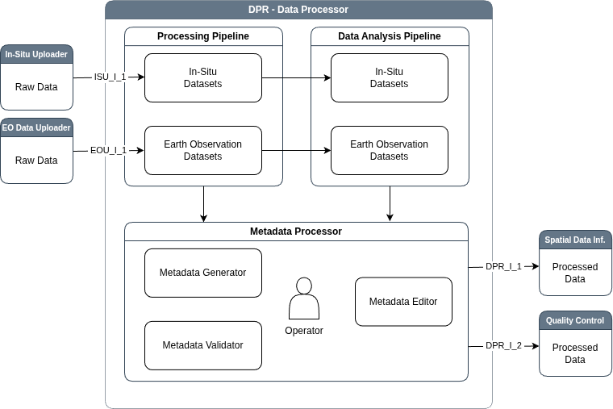

# Data Processing (DPR) Sub-system

The **Data Processing** sub-system serves as the central refinement
engine of the architecture, responsible for transforming raw inputs
into standardized, analysis-ready information products. It encompasses
three primary functional areas: metadata management, data
preprocessing, and advanced data analysis. The sub-system ensures that
all ingested data—whether from satellite imagery or in-situ
sensors—are accurately described, geometrically and atmospherically
corrected, and derived into meaningful indicators before storage. By
implementing modular pipelines, the system allows for the flexible
application of specific processing chains, such as atmospheric
correction for Earth Observation data or harmonized formatting for
sensor logs, ensuring compatibility with the Spatial Data
Infrastructure (SDI) and downstream Machine Learning (MAP)
sub-systems.



## Usage

Get list of preprocessing pipelines:

```py
from subsystems.dpr.preprocessing_pipelines import PreprocessingPipelines
print(PreprocessingPipelines().pipelines.keys())
```

Select preprocessing pipeline and get it's usage:

```
print(PreprocessingPipelines().pipelines['sentinel2_cloudcover'].metadata)
```

### Sentinel-1 processing

Utilize the `Sentinel1Pipeline` from `PreprocessingPipelines` to automatically
process Sentinel-1 SLC BURST data to compute displacement maps. The example also
includes downloading Sentinel-1 SLC BURST data using the `DataAcquisitionGateway`
module.

```py
from pathlib import Path

from subsystems.eou.data_acquisition_gateway import DataAcquisitionGateway
from subsystems.dpr.preprocessing_pipelines import PreprocessingPipelines
from lib.config import ProjectConfigReader, SettingsReader
from tests.utils import TestUtils

project_config = ProjectConfigReader(
    TestUtils.get_project_config_path('amd_monitoring_yxsjoberg')
)

base_dir = Path(SettingsReader()['storage']['data_dir']).resolve()
data_dir = base_dir / 'sentinel1'

if __name__ == '__main__':
    # download input data
    dag_module = DataAcquisitionGateway(backend='asf')
    results = dag_module.backend.search(
        geom=project_config.aoi(),
        start='2022-01-01',
        end='2022-01-31',
        direction='A',
    )
    dag_module.backend.download_all(results, target_dir=data_dir)

    # configure & run the pipeline
    pipeline = PreprocessingPipelines().pipelines['sentinel1']

    pipeline.configure(
        datadir=data_dir,
        aoi=project_config.aoi(),
        dem_path= data_dir / 'dem.nc',
        landmask_path= data_dir / 'landmask.nc',
        workdir= data_dir / 'workdir',
        result_dir= data_dir / 'results'
    )

    pipeline.run()
```

The results are stored in the `results` directory, which contains both
displacement and velocity data as well as environmental and risk
databases in CSV format.

`Sentinel1Pipeline` uses a Dask Cluster for its computations. The
parameters for this Dask Cluster can be configured in the global
`config.yaml` file (`dask_parameters` section). These should be
increased when processing larger volumes of data.

### Sentinel-2 processing

Preprocessing pipelines:

- `Sentinel2SafeProcessor` performs the conversion of a Level2A Sentinel-2 SAFE product to a image data file.
- `Sentinel2CloudCoverPipeline` reads metadata JSON files, computes cloud cover and other land cover classes from the SCL band and write the percentages to the metadata file.

Data analytical pipelines:

- `Sentinel2WaterMaskingPipeline` generates water masks for Sentinel-2 scenes.

The code example below demonstrates downloading Sentinel-2 data using
the `DataAcquisitionGateway` and applying the preprocessing pipelines
`Sentinel2SafeProcessor` and `Sentinel2CloudCoverPipeline`. Finally, the
data analysis pipeline `Sentinel2WaterMaskingPipeline` is executed.

```py
from pathlib import Path

from subsystems.eou.data_acquisition_gateway import DataAcquisitionGateway
from lib.config import ProjectConfigReader, SettingsReader
from tests.utils import TestUtils
from subsystems.dpr.preprocessing_pipelines import Sentinel2SafeProcessor
from subsystems.dpr.preprocessing_pipelines import Sentinel2CloudCoverPipeline
from subsystems.dpr.data_analysis_pipelines import Sentinel2WaterMaskingPipeline

#
# PART 1 - SENTINEL-2 PRODUCTS DOWNLOAD (SAFE)
#
project_config = ProjectConfigReader(
    TestUtils.get_project_config_path('amd_monitoring_yxsjoberg')
)

dag_module = DataAcquisitionGateway(backend='eodag')

search_filter = {
    'provider': 'cop_dataspace',
    'start': '2025-06-01',
    'end': '2025-06-05',
    'productType': 'S2_MSI_L2A',
}

results = dag_module.backend.search(
    geom=project_config.aoi(),
    **search_filter,
)
safe_list = dag_module.backend.download_all(
    results, target_dir='sentinel2', quicklook=False
)

#
# PART 2 - SENTINEL-2 CLIPPING AND RESAMPLING
#

# Set output folder:
s2_processed_folder = (
    Path(SettingsReader()['storage']['data_dir'])
    / 'sentinel2'
    / 'output_safe_processor'
)

# Set output resolution in meters
res = (10, 10)

# Set resampling algorithm
r_alg = 'bilinear'

# Run the pipeline
pipeline = Sentinel2SafeProcessor()
for safe_path in safe_list:
    pipeline.configure(
        input_safe=safe_path,
        output_folder=s2_processed_folder,
        roi=project_config.aoi(roi=True).wkt,
        target_res=res,
        resampling_alg=r_alg,
        overwrite=True,
    )
    # pipeline.run()

#
# PART 3 - RETRIEVING CLOUD COVER PERCENTAGE FROM CLIPPED SCENES
#

# Retrieve all JSON files from the folder
meta_list = s2_processed_folder.glob('*.json')

# Run the pipeline
pipeline = Sentinel2CloudCoverPipeline()
for meta_path in meta_list:
    pipeline.configure(metadata_path=meta_path, path_key='source_path')
    pipeline.run()

#
# PART 4 - CREATION OF WATER MASKS
#

# Set path to the vector file containing the water bodies
input_water_mask = TestUtils.get_data_path('dpr') / 'yxsjoberg_lakes.gpkg'
print(input_water_mask)
# Set path to output folder (delete pre-existing folder)
output_folder = (
    Path(SettingsReader()['storage']['data_dir']) / 'sentinel2' / 'output_water_masks'
)

# OPTION 1: Run the pipeline in default mode (without user input file, input_water_mask=None)
pipeline = Sentinel2WaterMaskingPipeline()
pipeline.configure(
    input_folder=s2_processed_folder,
    output_folder=output_folder,
    max_cloud_snow_dark=0.1,
    input_months=[4, 5, 6, 7, 8, 9, 10],
    start_date=project_config.monitoring_period.start,
    end_date=project_config.monitoring_period.end,
    input_water_mask=None,
    threshold_parameters={
        'shadow index': 0.9,
        'spectral angle': 0.15,
        'vnir regression slope': 1,
        'vnir regression intercept': -500,
        'band 2': 2000,
        'swir reflectance': 1000,
    },
)
pipeline.run()

# OPTION 2: Run the pipeline with vector file as input (input_water_mask provided)
pipeline = Sentinel2WaterMaskingPipeline()
pipeline.configure(
    input_folder=s2_processed_folder,
    output_folder=output_folder,
    input_water_mask=Path(input_water_mask),
    max_cloud_snow_dark=0.1,
    input_months=[4, 5, 6, 7, 8, 9, 10],
    start_date=project_config.monitoring_period.start,
    end_date=project_config.monitoring_period.end,
    threshold_parameters={
        'shadow index': 0.9,
        'spectral angle': 0.15,
        'vnir regression slope': 1,
        'vnir regression intercept': -500,
        'band 2': 2000,
        'swir reflectance': 1000,
    },
)
pipeline.run()
```
