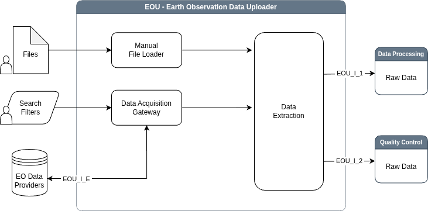

# Earth Observation Data Uploader (EOU) Sub-system

The **Earth Observation Data Uploader** sub-system is designed to manage
the acquisition of satellite imagery from both public and restricted
repositories. Public repositories are typically accessible via API and
are often covered by a STAC catalogue, while certain datasets that are
not available as open data require manual upload mechanisms. The
sub-system addresses this dual need through two primary pathways. The
**Manual Data Loader** allows operators to import datasets from restricted
sources, such as specific commercial providers or legacy archives,
which cannot be processed automatically. If these files are in
standard formats like GeoTIFF, the system supports automatic
recognition to minimize manual configuration. The **Data Acquisition
Gateway** automates the retrieval of new scenes by connecting to
services like Copernicus, Google Earth Engine, and NASA
Earthdata. This module actively monitors selected data sources and
downloads relevant imagery based on predefined criteria. All ingested
data is subsequently passed to the **Data Extraction** logic for
validation and integration into the processing pipeline.



## Usage

### Automated EO data acquisition

Utilize the `DataAcquisitionGateway` module to automatically retrieve
new scenes by connecting to services such as Copernicus, Google Earth
Engine, and NASA Earthdata. By default the `DataAcquisitionGateway` is
using EODAG package to search and download new data products.

```py
from subsystems.eou.data_acquisition_gateway import DataAcquisitionGateway
from lib.config import ProjectConfigReader
from tests.utils import TestUtils

project_config = ProjectConfigReader(
    TestUtils.get_project_config_path('amd_monitoring_yxsjoberg')
)

dag_module = DataAcquisitionGateway(backend='eodag')

search_filter = {
    'provider': 'cop_dataspace',
    'start': '2025-06-01',
    'end': '2025-06-05',
    'productType': 'S2_MSI_L2A',
}

results = dag_module.backend.search(
    geom=project_config.aoi(),
    **search_filter,
)
data_path = dag_module.backend.download_all(results, target_dir='sentinel2', quicklook=False)
print(data_path)
```

Configuration option `max_workers` (defined in the `eodag` section of
`config.yaml`) specifies the number of parallel workers used by
`download_all()`. The value should be chosen with regard to Copernicus
Data Space download quotas and limitations, especially the maximum
number of concurrent connections. See [Copernicus Quotas and
Limitations](https://documentation.dataspace.copernicus.eu/Quotas.html)
for details.

### Manual uploads

For data that cannot be automatically retrieved via
`DataAcquisitionGateway` and is available locally, use
`ManualFileLoader` module.

```py
file_path = '/../filename.tif'
loader_module = ManualFileLoader()
result = loader_module.check_file_validity(file_path)
```
