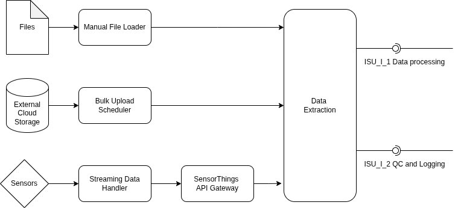

# In-Situ Data Uploader (ISU) Sub-system

The **In-Situ Data Uploader** is the core data ingestion hub for the GAIA-TSF platform. It is responsible for securely and efficiently collecting geotechnical and environmental data from physical sensors, external FTP directories, and high-frequency real-time data streams.

ISU employs a highly concurrent, decoupled modern architecture. All ingestion endpoints operate in parallel and converge at the central ETL Engine for standardized parsing and preliminary cleaning.

## Architecture Design

ISU strictly adheres to the D5.1 Architecture Specification, utilizing the Facade and Factory design patterns to ensure maximum decoupling.



The core module consists of a main orchestrator (Facade) and four sub-engines:

1. **InSituDataUploader (Facade):** The master controller. Provides a unified interface to start and stop the subsystem, managing component lifecycles and dependency injection.

2. **ETLEngine (Central Processing Hub):** Contains an intelligent routing ParsingEngine. It identifies CSV/Excel files, extracts timestamps, evaluates confidence scores, and acts as the centralized callback endpoint for all streaming data.

3. **BulkUploadScheduler (Background Scanner):** A daemon-backed scheduler. It periodically scans the `data/input` directory, routes newly discovered files to the ETL engine, and safely archives them to `data/processed` upon completion.

4. **ManualFileLoader (Manual API):** Designed to support frontend Web UIs or RESTful APIs. It accepts local file paths or raw byte streams and feeds them directly into the ETL engine.

5. **StreamingDataHandler (Real-time Stream Processor):** A built-in Factory that supports seamless subscription to Kafka, AWS Kinesis, and OGC SensorThings APIs. It features integrated QA/QC validation and graceful degradation.

## Directory Structure

```
subsystems/isu/
├── __init__.py                # ISU Facade class (InSituDataUploader)
├── etl_engine/                # Central ETL Hub
│   ├── __init__.py            # ETL Engine initialization
│   ├── pipeline.py            # Main ETL engine class
│   └── parsers/               # Intelligent file parsers module
├── bulk_upload_scheduler/     # Background bulk file scanner
│   ├── __init__.py            # Directory scanning & file archiving logic
│   └── scheduler.py           # Pure background thread scheduler
├── manual_file_loader/        # API for manual single-file uploads
│   └── __init__.py
├── streaming_data_handler/    # Real-time streaming data processor
│   ├── __init__.py            # Factory router & GaiaBase injector
│   └── stream_handler.py      # Concrete Kafka/Kinesis/OGC consumers
└── tests/                     # Automated integration & unit test suite
```

## Key Features

1. **100% GaiaBase Driven:** All core classes inherit from `lib.base.GaiaBase`, enabling out-of-the-box auto-injection of system-level configurations (`self.settings`) and logging (`self.logger`).

2. **Graceful Degradation:** If required streaming parameters (e.g., Kafka brokers) are missing, the system safely logs an error and disables that specific channel without disrupting other functionalities.

3. **Dynamic Factory Routing:** Seamlessly switch underlying data sources (Kafka ↔ Kinesis ↔ OGC) simply by modifying the `stream_source_type` in `settings.yaml`, requiring zero code changes.

4. **Integrated QA/QC Gatekeeping:** Streaming data automatically invokes the injected `qc_layer.check()` for strict metric validation before entering the ETL engine.

## Configuration

All ISU configurations are driven by the global `settings.yaml`. Below is an example of the available ISU parameters:

```yaml
# settings.yaml example
isu:
  # --- Bulk Scanning Config ---
  input_dir: "data/input"
  processed_dir: "data/processed"
  bulk_scan_interval_sec: 10

  # --- Real-time Streaming Config ---
  # Valid options: 'kafka', 'kinesis', 'sensorthings', 'none'
  stream_source_type: "kafka"

  # Kafka specifics
  kafka_broker: "localhost:9092"
  kafka_topics: ["slope_stability", "water_quality"]

  # Kinesis specifics
  kinesis_stream: "tsf_live_stream"
  kinesis_region: "eu-central-1"
  kinesis_iterator_type: "LATEST"

  # OGC SensorThings specifics
  ogc_broker: "mqtt.example.org:1883"
  ogc_datastream_id: "99"
```
