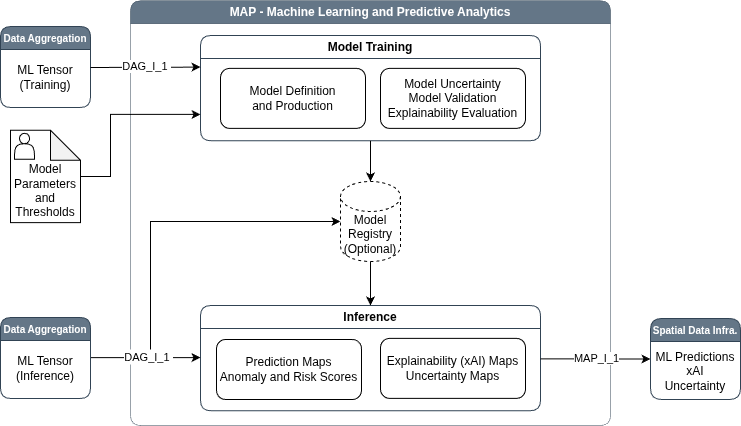

# Machine Learning Predictive Analytics (MAP) Sub-system

Trend detection, anomaly analysis, and dynamic risk scoring.

The **Machine Learning Predictive Analytics** sub-system functions as
the core intelligence engine of the GAIA-TSF architecture, responsible
for transforming historical and current monitoring data into
actionable predictive insights (trend, anomaly, and risk scoring). The
sub-system is designed to execute comprehensive modeling workflows
that include data ingestion, feature engineering, model training,
inference, and output results upload.



## Usage

Prepare synthetic data of slope stability:

```
python3 /gaia_tsf/map/synthetic_data/create_synthetic_data.py
```

