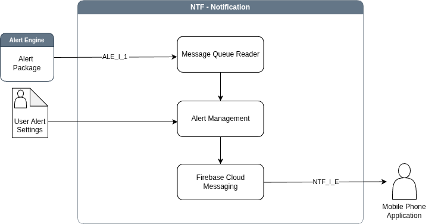

# Notifications (NTF) Sub-system

The **Notification** sub-system is designed to serve as the
final link in the monitoring chain, ensuring that critical
intelligence generated by the platform reaches operational
stakeholders in a timely manner. Its primary function is to bridge the
gap between the internal Alert and Decision Support Engine and the
physical devices of end-users. This is achieved by monitoring a
message queue for incoming alert packages and utilizing cloud-based
messaging infrastructure to push these notifications to a dedicated
mobile application. Beyond simple message delivery, the sub-system
provides situational awareness through a mobile interface that
categorizes alert severity using intuitive color coding (e.g., green,
yellow, and red) allowing operators to instantly assess the urgency of
a situation. Furthermore, the sub-system includes a management layer
that enables users to customize their alerting preferences, such as
defining specific areas of interest and setting frequency limits,
ensuring that notifications remain relevant and actionable.

## Usage
