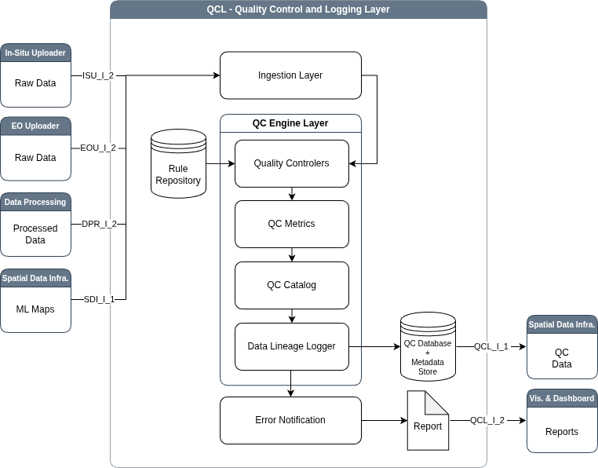

# Quality Control and Logging Layer (QCL) Sub-system

The **Quality Control Layer** serves as the critical validation gatekeeper
within the GAIA-TSF monitoring architecture, situated between the
ingestion/ETL processes and the Spatial Data Infrastructure (SDI)
storage. Its primary function is to enforce established quality
standards across all incoming data streams, ensuring that only
reliable and traceable data supports the downstream analytics and
decision-making modules. This layer automates the verification of data
integrity through specific checks—such as validating physical ranges
for pH levels in water quality data or assessing cloud cover
percentages in satellite imagery—and logs the lineage of every dataset
to maintain a complete audit trail. By combining automated metric
calculation with mechanisms for manual review and error alerting, the
system guarantees high-fidelity inputs for predictive modeling and
risk assessment.

Its job is to validate all data (In-Situ and Earth Observation) before
it is saved or analyzed. It ensures the system only uses high-quality,
realistic data.



## Key Features
* **Automated QC**: Runs real-time checks using the `qc_layer.check()` method.
* **Status Tagging**: Automatically marks datasets as `Pass`, `Warn`, or `Fail`.
* **Data Lineage**: Keeps a permanent record of all checks for safety audits.
* **Smart Metadata Validation**: Checks for missing fields in EO data and triggers warnings.

## Folder Structure
* `__init__.py`: Provides the **`QCLayer`** alias for easy importing.
* `layer.py`: Contains the **`QualityControlLoggingLayer`** class and core logic.
* `README.md`: This documentation file.

## Interfaces
* **Input**: Intercepts DataFrames from `ISU` (In-Situ) and `EOU` (Earth Observation).
* **Output**: Sends verified data to the SDI and alerts to the Notification system.

## Usage

This example shows the standard way to use the QCL, matching the logic in our unit tests.

```python
import pandas as pd
# 1. Import the QCLayer alias
from subsystem.qcl import QCLayer 

# 2. Initialize the component as 'qc_layer'
qc_layer = QCLayer()

# 3. Create sample In-Situ data (pH values)
# In our tests, pH > 14 will trigger a failure.
df = pd.DataFrame(
    {'ph': [7.2, 15.5, 8.1]}, 
    index=[101, 102, 103]
)

# 4. Perform the check
# Usage follows the qc_layer.check() pattern
result = qc_layer.check(
    data_type='in_situ',
    data=df,
    metadata={'sensor': 'piezometer'},
    dataset_id='TEST_BATCH_001'
)

# 5. Handle the result
if result['final_status'] == 'Fail':
    print(f"Data Rejected! Errors: {result['errors']}")
    # Expected: "pH values out of 0-14..."
```
