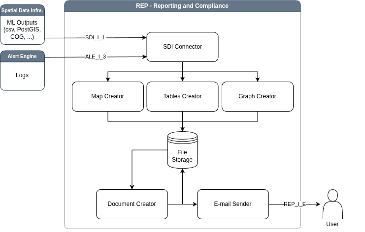

# Reporting Compliance (REP) Sub-system

The **Reporting and Compliance** sub-system serves as the formal
output engine of the GAIA-TSF architecture, transforming complex
analytical data into actionable and legally referenceable
documentation. Its primary function is to automatically synthesize
data from upstream sub-systems, specifically the Machine Learning and
Predictive Analytics modules and the SDI, into standardized
reports. This process involves distinct creators for maps, graphs, and
tables, which individually process ML outputs (such as prediction
maps, anomaly scores, and time-series trends) before a central
Document Creator assembles them into a cohesive PDF file.

## Usage
