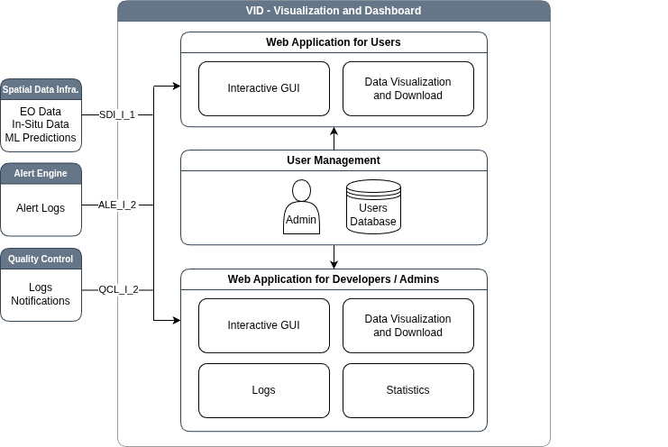

# Visualisation Dashboard (VID) Sub-system

The **Visualization and Dashboard** sub-system serves as the primary
user interface for the GAIA-TSF platform, designed to present the
analytical outputs of the machine learning and monitoring sub-systems
to end-users. Its core function is to visualize the results of
continuous data processing, focusing on statistical insights and the
spatial representation of alert situations rather than controlling the
processing workflow itself. The system is split into two main
functional areas: a web application for general users and a monitoring
dashboard for administrators and developers.

## Usage
